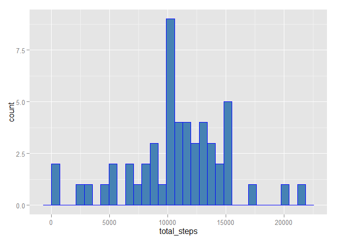
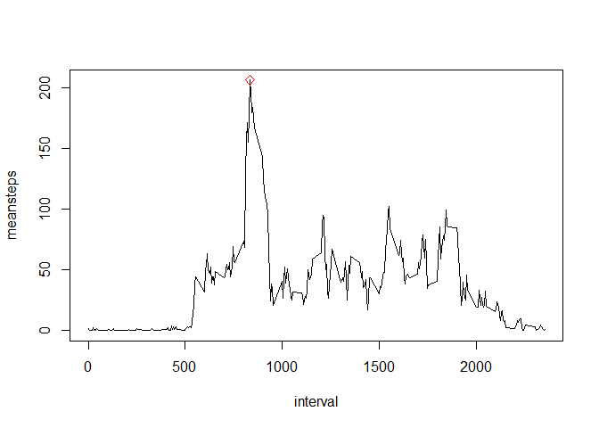
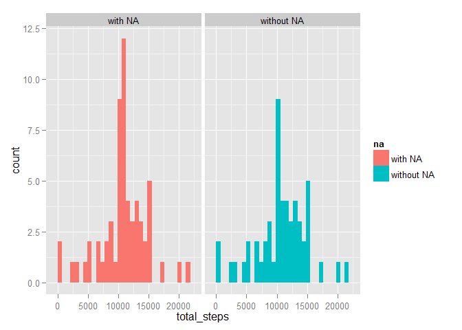
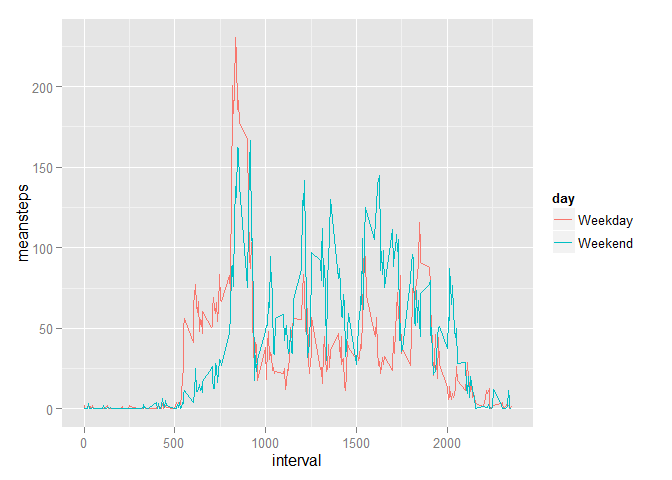

# PA1_template.Rmd
Bin  
Sunday, October 19, 2014  

# Peer Assessment 1
## A study of personal activity using data generated from activity monitoring devices

To address this problem we attempt to anaylsis data from a personal activity monitoring device. This device collects data at 5 minute intervals through out the day. The data consists of two months of data from an anonymous individual collected during the months of October and November, 2012 and include the number of steps taken in 5 minute intervals each day.

1. Loading and preprocessing the data  
First, we downloaded [Activity monitoring data](https://d396qusza40orc.cloudfront.net/repdata%2Fdata%2Factivity.zip) from our course website, and then loaded it into R using R script as shown below. All NAs were then removed in steps_activity.

```r
library(ggplot2)
library("plyr")

activity <- read.csv("activity.csv")
steps_activity <- activity[!is.na(activity$steps),]
```

2. What is mean total number of steps taken per day?  
We then calculate the total steps by grouping according to date. 

```r
dailysteps <- ddply(steps_activity, .(date), summarise, total_steps=sum(steps))
g <- ggplot(data=dailysteps, aes(total_steps))
g + geom_histogram (fill="steelblue", color="blue")
```

```
## stat_bin: binwidth defaulted to range/30. Use 'binwidth = x' to adjust this.
```

 

```r
summary(dailysteps$total_steps)
```

```
##    Min. 1st Qu.  Median    Mean 3rd Qu.    Max. 
##      41    8841   10760   10770   13290   21190
```
As shown in the figure above, except the resting day (0 steps), the distribution of total steps is similar to a normal distribution, with the aveage steps around 10770.

3. What is the average daily activity pattern?  
To address this problem, to calculated the average steps by grouping according to interval time.

```r
meaninterval <- ddply (steps_activity, .(interval), summarise, meansteps=mean(steps))
max <-meaninterval$meansteps==max(meaninterval$meansteps)
with(meaninterval, plot(x=interval, y=meansteps, type="l"))
points(x=meaninterval$interval[max], y=meaninterval$meansteps[max], col="Red",pch=5)
```

 

```r
meaninterval[max,]
```

```
##     interval meansteps
## 104      835  206.1698
```
According to the figure shown above, most people choose to have some exercise in the moring, more precisely, around 8am to 9am, with the peak of average steps 206 steps at 8:21. Also, there are several small peaks around 12pm, 4pm and 7pm, suggesting people would also like to excecise around that time. 

4.Imputing missing values  
Noticed that, we do have excluded all of the NA data, which will further lead to some bias.
the total number of missing values in the dataset is 2304

```r
na <- is.na(activity$steps)
sum (na)
```

```
## [1] 2304
```

To evalute and also reduce this effect, we substitued the missing value with the mean of the corresponding interval generated in section 3.


```r
steps_activity2 <- activity

for (i in seq_len(nrow(activity))) {
        if(is.na(activity$steps[i])) {
                steps_activity2[i,1]= meaninterval[meaninterval$interval==steps_activity2[i,3],2]
        }
        
}

dailysteps2 <- ddply(steps_activity2, .(date), summarise, total_steps=sum(steps))
summary(dailysteps2$total_steps)
```

```
##    Min. 1st Qu.  Median    Mean 3rd Qu.    Max. 
##      41    9819   10770   10770   12810   21190
```

```r
dailysteps$na <- "without NA"
dailysteps2$na <- "with NA"
daily <- rbind(dailysteps,dailysteps2)
daily$na <- as.factor(daily$na)

g <- ggplot(data=daily, aes(total_steps))
g + geom_histogram (aes(fill=na)) + facet_grid(. ~na)
```

```
## stat_bin: binwidth defaulted to range/30. Use 'binwidth = x' to adjust this.
## stat_bin: binwidth defaulted to range/30. Use 'binwidth = x' to adjust this.
```

 
  
As shown above, removing all the missing data will slightly impact on the final result, however the shape of the distribution is barely affected.

5. Are there differences in activity patterns between weekdays and weekends?  
To address the question, the average steps were recalculated according to weekdays and weenends using dataset with the filled-in missing values generated from section 4.

```r
Sys.setlocale("LC_TIME", "English")
```

```
## [1] "English_United States.1252"
```

```r
steps_activity2$day <- weekdays(as.Date(steps_activity2$date))

for (i in seq_len(nrow(steps_activity2))) {
        if (steps_activity2[i,4] %in% "Saturday" | steps_activity2[i,4] %in% "Sunday" )  {
                steps_activity2[i,4] <- "Weekend"
        } else {steps_activity2[i,4] <- "Weekday"
        }
}

steps_activity2$day<-as.factor(steps_activity2$day)
        
meaninterval2 <- ddply (steps_activity2, .(day, interval), summarise, meansteps=mean(steps))        
        
g <- ggplot (meaninterval2, aes(interval, meansteps))
g+geom_line(aes(color=day))
```

 
  
  
As indicated in the figure, people intended to exercise in the morning and night on weekdays, while in the afternoon on weekends
